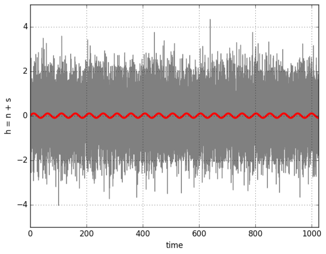

```python
import numpy as np
import matplotlib.pyplot as plt 

dt = 0.05                            # sampling time 
N = 1024                             # number of points 

t = np.arange(0, N, dt)

nse = np.random.randn(len(t))        # Gaussian noise

amp = 0.1                            # amplitude 
fre = 2.5*np.pi                      # and frequency 
sig = amp*np.sin(t/fre)              # of the signal           

h = nse + sig 

plt.plot(t, h, '-', color="grey")

plt.plot(t, sig, '-', color="red", linewidth=3)
plt.xlim(0, N)
plt.xlabel('time')
plt.ylabel('h = n + s')
plt.grid(True)

plt.savefig("gaussian_noise_plus_signal.png", format="png", bbox_inches="tight") 
```

This results in the following figure: 
{:.centerpic}


For the first sight the red sinusoid is hopelesly buried 
in the Gaussian noise data. How to know something is there? 
Fourier transform for the rescue.  
