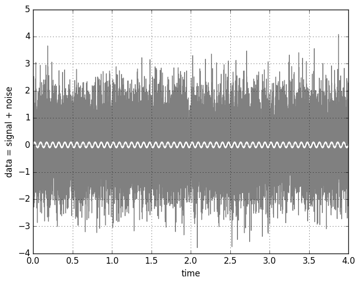
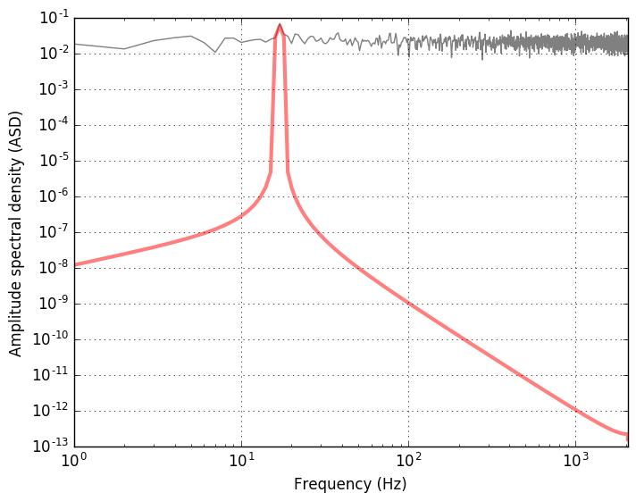

While playing with the [`find_inspiral.py` optimal match filter 
script](https://losc.ligo.org/tutorial_optimal) from the 
[LIGO Open Science Center](https://losc.ligo.org/about) I rewrote 
it for a simpler purpose of a purely periodic gravitational wave 
(similar to those emitted by rotating deformed neutron stars). 
This example shows the simplest matched filter - the Fourier transform - 
and compares the signal-to-noise ratio from the optimal filter, which uses 
the actual signal as a template is actually the added signal, 
to an signal-to-noise estimate. 
Sample data and the signal may be generated as follows:    

```python
"""
Gaussian noise with a sinusoidal signal added 
"""
import numpy as np
import matplotlib.pyplot as plt

fs = 4096           # sampling rate [Hz]  
T = 4               # duration [s]
amp = 0.1           # amplitude of the sinusoid 
ome = 17            # frequency of the signal 

N = T*fs            # total number of points 

# time interval spaced with 1/fs 
t = np.arange(0, T, 1./fs)
 
# white noise 
noise = np.random.normal(size=t.shape)

# sinusoidal signal with amplitude amp
template = amp*np.sin(ome*2*np.pi*t)
 
# data: signal (template) with added noise 
data = template + noise

plt.figure()
plt.plot(t, data, '-', color="grey")
plt.plot(t, template, '-', color="white", linewidth=2)
plt.xlim(0, T)
plt.xlabel('time')
plt.ylabel('data = signal + noise')
plt.grid(True)
 
plt.savefig("gaussian_noise_w_signal.png", format="png", bbox_inches="tight")
```

The resulting figure is   



The signal is hidden so deep in the noise that it's not at all apparent 
that it actually is there. Fortunarely, we have several techniques 
to try and find out whether the signal is present in the noisy data 
or not. One of the most powerful is the 
[matched filter](https://en.wikipedia.org/wiki/Matched_filter) method. 
The case of a sinusoidal signal is informative, because the matched filter 
is just the Fourier transform. 

```python
"""
Discrete Fourier transform of the signal in noise 
"""

# FFT of the template and the data (not normalized)  
template_fft = np.fft.fft(template)
data_fft = np.fft.fft(data)

# Sampling frequencies up to the Nyquist limit (fs/2)  
sample_freq = np.fft.fftfreq(t.shape[-1], 1./fs)

plt.figure()
plt.plot(sample_freq, np.abs(template_fft), color="red", alpha=0.5, linewidth=4)
plt.plot(sample_freq, np.abs(data_fft), color="grey")

# taking positive spectrum only: plt.xlim(0, np.max(sample_freq)) 
# peak closeup:   
plt.xlim(0, 3*ome)
plt.xlabel('Frequency bins')
plt.ylabel('FT power (not normalized)')
plt.grid(True)

plt.savefig("fft_gaussian_noise_w_signal.png", format="png", bbox_inches="tight")

```
 
The method [`np.fft.fftfreq`](http://docs.scipy.org/doc/numpy/reference/generated/numpy.fft.fftfreq.html) conveniently produces the frequency bins in cycles per unit of the sample spacing up to the half of the sampling frequency (the [Nyquist frequency](https://en.wikipedia.org/wiki/Nyquist_frequency)). We get             


One may also have a look at the spectrum density of the data and compare 
it with the pure signal. Instad of the power spectral density, the amplitude 
spectral density is used in the GW data analysis, because what is measured is 
the GW strain amplitude. ASD is the square root of the PSD. 

```python 
"""
Power and amplitude spectral density using plt.psd
"""

# Power spectrum density of the data and the signal template  
power_data, freq_psd = plt.psd(data, Fs=fs, NFFT=fs, visible=False)
power, freq = plt.psd(template, Fs=fs, NFFT=fs, visible=False)

plt.figure()
# sqrt(power_data) - amplitude spectral density (ASD)
plt.loglog(freq_psd, np.sqrt(power_data), 'gray')
plt.loglog(freq, np.sqrt(power), color="red", alpha=0.5, linewidth=3)

# range is from 0 to the Nyquist frequency
plt.xlim(0, fs/2)

plt.xlabel('Frequency (Hz)')
plt.ylabel('Amplitude spectral density (ASD)')
plt.grid(True)

plt.savefig("amplitude_spectrum.png", format="png", bbox_inches="tight")

``` 
The plot shows the amplitude spectral density of the data (mostly noise) 
and the signal (in red) with a peak at frequency corresponding to the 
chosen frequency `ome=17`. 



Let's check now if we can recover the signal with the properly implemented 
matched filter using the FFT. The relevant few lines of code are  

```python
"""
Optimal matched filter 
"""

# Matching the FFT frequency bins to PSD frequency bins
# (in the region where is no signal)
power_vec = np.interp(sample_freq, freq_psd[2*ome:], power_data[2*ome:])

# Applying the optimal matched filter (template is the added signal, 
# in general case one should go through the parameters space of the filter bank)
optimal_filter = 2*np.fft.ifft(data_fft*template_fft.conjugate()/power_vec) 

# Normalize the matched filter output
df = np.abs(sample_freq[1] - sample_freq[0])
sigmasq = 2*(template_fft * template_fft.conjugate() / power_vec).sum() * df
sigma = np.sqrt(np.abs(sigmasq))

# Signal-to-noise 
SNR = np.max(abs(optimal_filter)/sigma)
print SNR 
```
The output depends somehow on the realization of noise, but it's about 10. 
The SNR can be estimated by taking approximate values of the Fourier transform 
integrals defined above. 

For the additive noise process, the data $s(t)$ is defined as the sum of 
the signal and the noise: 

$$
s(t) = h(t) + n(t). 
$$ 

The optimal filter is defined as 

$$
4\Re\int_{0}^{\infty}\frac{\tilde{s}(f)\tilde{h}_{\text{template}}^\ast(f)}{S_n(f)} \mathrm{e}^{2\pi ift} df, 
$$ 

where the $*$ symbol denotes complex conjugation, $\Re$ is the real part of the integral, and 
$\tilde{h}_{\text{template}}(f)$ and $\tilde{s}(f)$ are the Fourier transform of the 
time-domain template and the data:  

$$
  \tilde{s}(f) = \int_{-\infty}^\infty s(t) \mathrm{e}^{-2\pi ift} dt.
$$

The inverse Fourier transform is

$$
  s(t) = \int_{-\infty}^\infty \tilde{s}(f) \mathrm{e}^{2\pi ift} df
$$
 

```python 
# Estimate of the signal-to-noise 
SNR_estimate = amp*np.sqrt(T)/np.sqrt(np.average(power_vec))

print SNR_estimate, SNR

```


