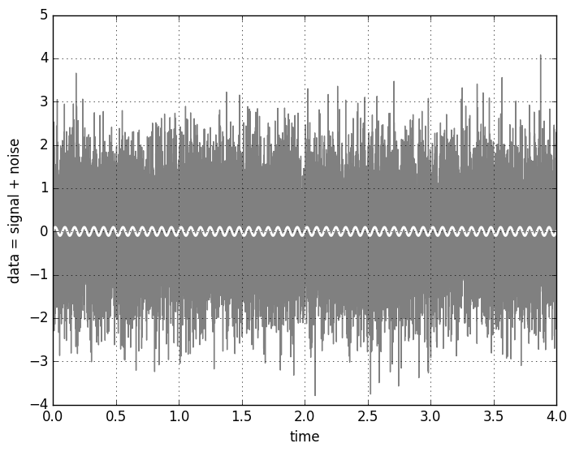
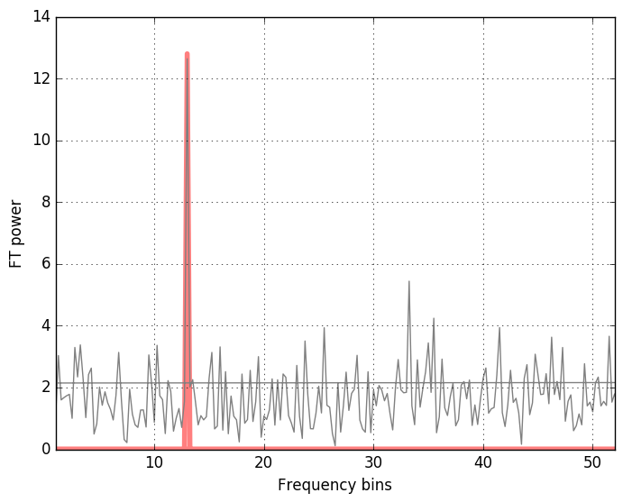
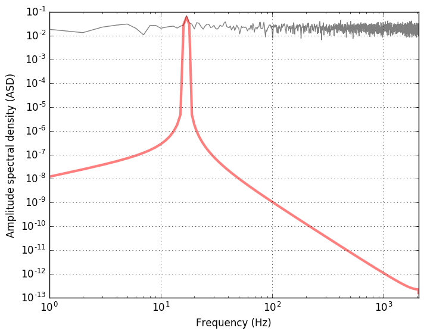

While playing with the [`find_inspiral.py` optimal match filter
script](https://losc.ligo.org/tutorial_optimal) from the [LIGO Open Science
Center](https://losc.ligo.org/about) I rewrote it for a simpler purpose of a
purely periodic gravitational wave, similar to those emitted by slightly deformed 
rotating neutron stars. This example shows the simplest matched filter - the
[Fourier transform](https://en.wikipedia.org/wiki/Fourier_transform) - and 
defines the signal-to-noise ratio from the matched filter (using the 
actual signal as a filter), to an signal-to-noise estimate. 

Sample data and the signal may be generated as follows:    

```python
"""
Gaussian noise with a sinusoidal signal added 
"""
import numpy as np
import matplotlib.pyplot as plt

fs = 4096           # sampling rate [Hz]  
T = 4               # duration [s]
amp = 0.1           # amplitude of the sinusoid 
ome = 13            # frequency of the signal 

N = T*fs            # total number of points 

# time interval spaced with 1/fs 
t = np.arange(0, T, 1./fs)
 
# white noise 
noise = np.random.normal(size=t.shape)

# sinusoidal signal with amplitude amp
template = amp*np.sin(ome*2*np.pi*t)
 
# data: signal (template) with added noise 
data = template + noise

plt.figure()
plt.plot(t, data, '-', color="grey")
plt.plot(t, template, '-', color="white", linewidth=2)
plt.xlim(0, T)
plt.xlabel('time')
plt.ylabel('data = signal + noise')
plt.grid(True)
 
plt.savefig("gaussian_noise_w_signal.png", format="png", bbox_inches="tight")
```

The resulting figure is   



The signal is hidden so deep in the noise that it's not at all apparent 
that it actually is there. Fortunarely, we have several techniques 
to try and find out whether the signal is present in the noisy data 
or not. One of the most powerful is the 
[matched filter](https://en.wikipedia.org/wiki/Matched_filter) method. 
The case of a sinusoidal signal is informative, because the matched filter 
is just the [Fourier transform](https://en.wikipedia.org/wiki/Fourier_transform). 

```python
"""
Discrete Fourier transform of the signal in noise 
"""

# FFT of the template and the data (not normalized)  
template_fft = np.fft.fft(template)
data_fft = np.fft.fft(data)

# Sampling frequencies up to the Nyquist limit (fs/2)  
sample_freq = np.fft.fftfreq(t.shape[-1], 1./fs)

# FT power 
plt.figure()
plt.plot(sample_freq, np.abs(template_fft)/np.sqrt(fs), color="red", alpha=0.5, linewidth=4)
plt.plot(sample_freq, np.abs(data_fft)//np.sqrt(fs), color="grey")

# taking positive spectrum only: plt.xlim(0, np.max(sample_freq)) 
# peak closeup:   
plt.xlim(0, 4*ome)
plt.xlabel('Frequency bins')
plt.ylabel('FT power')
plt.grid(True)

plt.savefig("fft_gaussian_noise_w_signal.png", format="png", bbox_inches="tight")
```
 
The method [`np.fft.fftfreq`](http://docs.scipy.org/doc/numpy/reference/generated/numpy.fft.fftfreq.html) conveniently produces the frequency bins in cycles per unit of the sample spacing up to the half of the sampling frequency (the [Nyquist frequency](https://en.wikipedia.org/wiki/Nyquist_frequency)). We get             



One may also have a look at the spectrum density of the data and compare 
it with the pure signal. Instad of the power spectral density, the amplitude 
spectral density is used in the GW data analysis, because what is measured is 
the GW strain amplitude. ASD is the square root of the PSD. 

```python 
"""
Power and amplitude spectral density using plt.psd
"""

# Power spectrum density of the data and the signal template  
power_data, freq_psd = plt.psd(data, Fs=fs, NFFT=fs, visible=False)
power, freq = plt.psd(template, Fs=fs, NFFT=fs, visible=False)

plt.figure()
# sqrt(power_data) - amplitude spectral density (ASD)
plt.loglog(freq_psd, np.sqrt(power_data), 'gray')
plt.loglog(freq, np.sqrt(power), color="red", alpha=0.5, linewidth=3)

# range is from 0 to the Nyquist frequency
plt.xlim(0, fs/2)

plt.xlabel('Frequency (Hz)')
plt.ylabel('Amplitude spectral density (ASD)')
plt.grid(True)

plt.savefig("amplitude_spectrum.png", format="png", bbox_inches="tight")
``` 
The plot shows the amplitude spectral density of the data (mostly noise) 
and the signal (in red) with a peak at frequency corresponding to the 
chosen frequency `ome=13`. 



Let's check now if we can recover the signal with the properly implemented 
matched filter using the FFT. The relevant few lines of code are  

```python
"""
Optimal matched filter 
"""

# Matching the FFT frequency bins to PSD frequency bins
# (in the region where is no signal)
power_vec = np.interp(sample_freq, freq_psd[2*ome:], power_data[2*ome:])

# Applying the matched filter (template is the signal)
matched_filter = 2*np.fft.ifft(data_fft * template_fft.conjugate()/power_vec)
SNR_matched = np.sqrt(np.abs(matched_filter)/fs)

# Optimal filter 
optimal_filter = 2*np.fft.ifft(template_fft * template_fft.conjugate()/power_vec)
SNR_optimal = np.sqrt(np.abs(optimal_filter)/fs)

# Estimate of the signal-to-noise 
SNR_estimate = amp*np.sqrt(T)/np.sqrt(np.average(power_vec))

print "SNR_estimate", SNR_estimate, "SNR_optimal", np.max(SNR_optimal), "SNR_matched", np.max(SNR_matched)
```

The output depends on the realization of noise. The SNR can be estimated by approximating the output of the matched filter. 

Let's define the scalar product $(x\lvert y)$ using the Fourier transform: 

$$
(x\lvert y) = 4\Re\int_{0}^{\infty}\frac{\tilde{x}(f)\tilde{y}^\ast(f)}{S_n(f)} \mathrm{e}^{2\pi ift} df, 
$$ 

where the $*$ symbol denotes complex conjugation, $\Re$ is the real part of the integral, and 
$\tilde{x}(f)$ and $\tilde{y}(f)$ are the Fourier transform of the 
time-domain data series:  

$$
  \tilde{x}(f) = \int_{-\infty}^\infty x(t) \mathrm{e}^{-2\pi ift} dt.
$$

The inverse Fourier transform is

$$
  x(t) = \int_{-\infty}^\infty \tilde{x}(f) \mathrm{e}^{2\pi ift} df. 
$$

$S_n(f)$ is the one-sided power spectral density of the detector's noise. For a stable detector we may assume the that $S_n(f)\approx S_0=const.$ over the data span. Then, using the [Parseval's theorem](https://en.wikipedia.org/wiki/Parseval%27s_theorem), we have

$$
  \left(x\lvert y\right) \approx \frac{2}{S_0}\int_0^T x(t) y(t) dt.
$$

For the additive noise process, the data $s(t)$ is defined as the sum of 
the signal and the noise: 

$$
s(t) = h(t) + n(t).   
$$ 

The matched filter output of the data stream $s(t)$ with a filter template $h_{templ.}(t)$ (correlation of the data with a possible signal with the model of this signal) is defined using the scalar product  

$$ 
  4\Re\int_{0}^{\infty}\frac{\tilde{s}(f)\tilde{h}^\ast_{templ.}(f)}{S_n(f)} \mathrm{e}^{2\pi ift} df
$$

The optimal signal to noise ratio is defined as 

$$ 
  \rho := \sqrt{(h\lvert h)}
$$
  
For a periodic signal $h(t) = h_0\cos(\phi(t) + \phi_0)$, we will assume that the data span $T_0$ is much longer than the period of the wave, $P_0 = 1/f_0$, and that the phase can be expanded in the series $\phi(t)=\Sigma_{k} a_k t^{k+1}$. Also 

$$ 
  \frac{1}{T_0}\int_0^{T_0} \cos(n\phi(t))dt \approx \frac{1}{T_0}\int_0^{T_0} \sin(n\phi(t))dt \approx 0
$$  

for integers $n>0$. Integrating the $\rho^2$ for $h(t) = h_0\cos(\phi(t) + \phi_0)$ gives approximately  

$$ 
  \rho^2 = \frac{2}{S_0}\int_0^{T_0} \left(h(t)\right)^2 dt = \frac{2}{S_0}\int_0^{T_0} h_0^2\cos^2(\phi(t) + \phi_0) dt \approx h_0^2\frac{T_0}{S_0}. 
$$ 

The estimate for the optimal signal to noise ratio for a periodic signal of the amplitude $h_0$ is therefore 

$$
  \rho \approx h_0\left(\frac{T_0}{S_0}\right)^{1/2}. 
$$

For [this](../data/data_and_template.hdf5) data and template packed in the `hdf5` format, 
I get 

```
SNR_estimate 10.1863371439 SNR_optimal 11.5740920133 SNR_matched 11.5128482391
```

Here is how to read in the `hdf5`:  


```python
import h5py

# Read in data and template
dataFile = h5py.File('data_and_template.hdf5', 'r')
data = dataFile['datawsignal'][...]
template = dataFile['template'][...]
dataFile.close()
```

Check out this [gist](https://gist.github.com/mbejger/db2b3479c4bccc771e26c1604388bcc3) for the whole script. 
